💻프로젝트 개요
-
---
자바를 익히며 배운 stream,람다,제네릭 등등 을 적용해보는 프로젝트로 GUI,CLI 3단계로 나눠서 진행했습니다.

✏️GUI기반 설계
-
---
목표 계산기
-

구현한 계산기
-
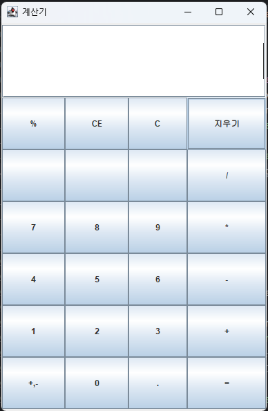

---
구조 및 기능 설계
-
---
기능
-
---
>사칙연산
-   기본적인 + , - , / , * 입력창에 직접 입력가능, 버튼 클릭 해서도 입력 가능
- 소수 계산 기능
- 한 번에 여러 사칙연산 가능 ex) 5+4*2-2
>초기화
-  " C " 버튼 클릭 시 입력 데이터 전체 삭제
-  " 지우기 "" 버튼 클릭 시 입력데이터 한 개 삭제
>계산된 수 화면 보이기
- 계산 후 데이터 화면에 넣어줌
>숫자와 사칙연산 기호만 입력받기
-  사칙연산 기호 2개가 연속으로 입력 시 나중에 들어온 기호로 변경 ex) -+ --> + 로 변경 
-  ctrl + v 로 입력했을 때 문자열 전체 검사
-  마지막에 기호 입력 시 제거

---

UI
-
---

1.전체구조

2.숫자버튼

3.사직연산버튼

4.초기화버튼

5.닫기 버튼

6.입력창

---

코드
-

---

> 계산기 UI

- UI 그려줄 객체,버튼 텍스트 저장하는 배열 선언
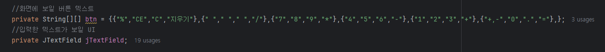
-  계산기 관련 메소드 관리하는 인터페이스
   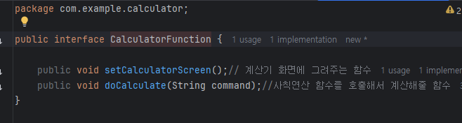
- 계산기 ui 그려주는 코드 배열로 미리 선언한 텍스트
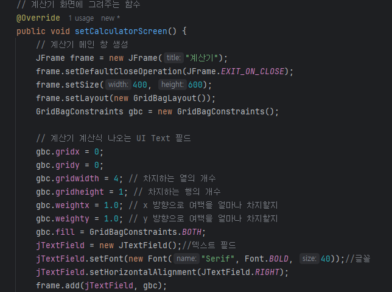
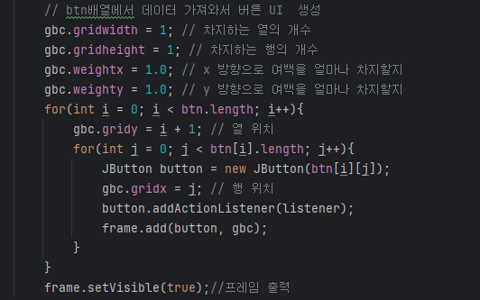

뿌려주며 버튼 그려줌

> UI 리스너 
- 입력창에 데이터 들어오면 실시간으로 반응하는 함수 in,out만 사용
- Enter 입력 시 계산 해주는 리스너

- 버튼 클릭 시 이벤트 발생한 버튼에 따라 반응하는 리스너
  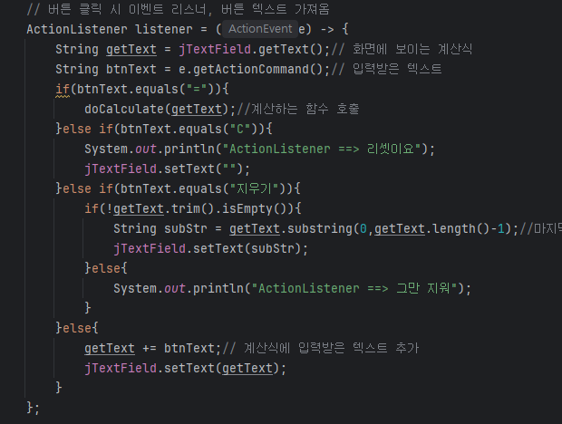

---

> 계산 메소드

- 인터페이스
- 람다 활용 가능하게 @Function 이노테이션 선언
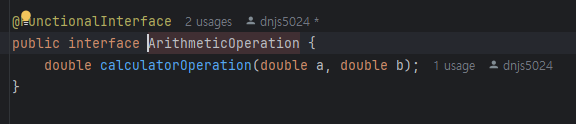

- enum 상수로 사칙연산 객체 선언, 상수 호출 시 생성자를 통해 symbol,
- 람다로 선언한 함수를 private 선언한 변수에 저장,
- getOperation 함수 호출을 통해 접근해서 계산해줌

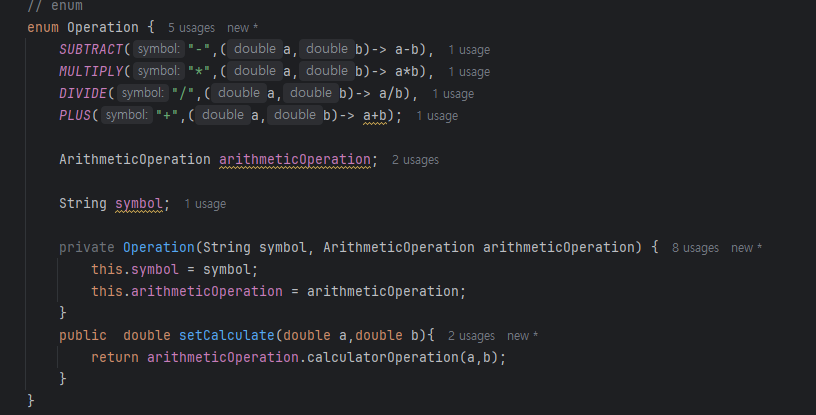

- 데이터 잘라줄 구분자 선언 및 계산에 활용할 변수들 초기화
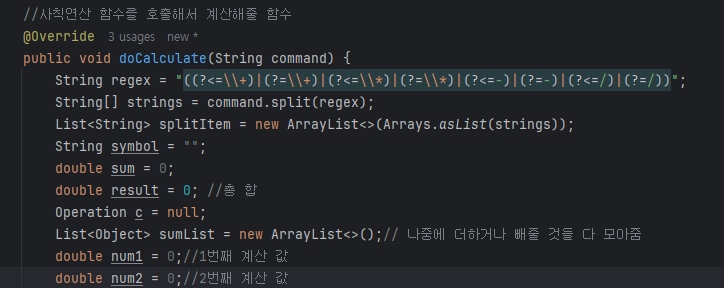

- 자른 값들을 모두 sumList에 저장 후 연산한 피연산자,연산자는 
- 제거하고 결과를 다시 sumList에 저장해줌
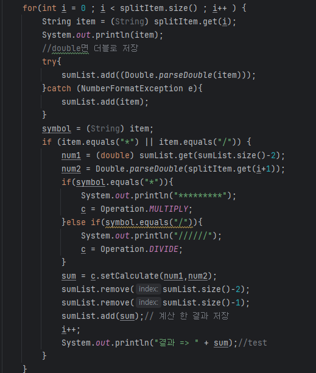

- sumList에서 값을 꺼내서 전부 연산
- 소수점 2자리 까지만 보여지게 저장
- 연산자 없이 숫자 한개만 들어왔을 떄 처리하는 코드
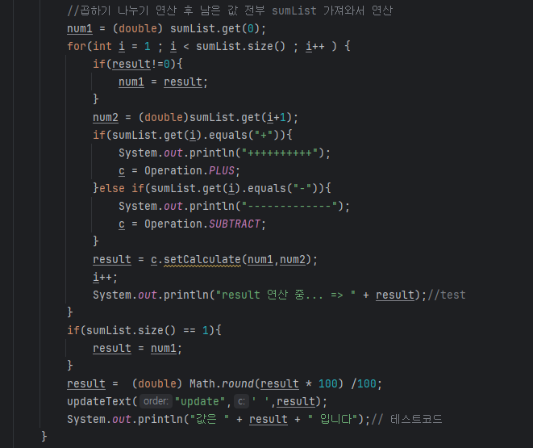

> 데이터 업데이트

- 텍스트필드에 안전하게 데이터 변경해주는 
- SwingUtilities.invokeLater 메소드 활용해서 적용
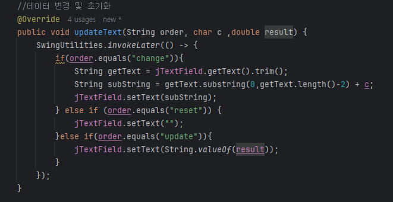

---

> 데이터 검증 메소드

- 입력 리스너를 통해 호출
- 한번에 많은 입력데이터가 들어오는 경우(ctrl V) 대비해서
- char배열로 변환후 데이터 검증 
- 기호가 2개 입력시 나중 입력 데이터로 교체 ex) + * -> *

---

✏️CLI 기반 설계 
-

총 3단계로 점점 기능을 추가하며 리펙토링 하는 식으로 진행

---

1️⃣1단계 한 개의 class로 구현    
-
> 메인  

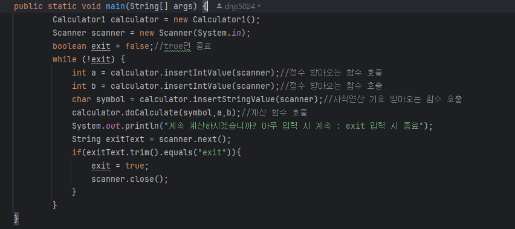

입력을 받아주는 메소드 호출해서 입력받고 계산 메소드에서 계산 후 보여줌,
while문 으로 반복해서 입력 받다가 사용자가 exit 입력 시 종료

> 입력 메소드

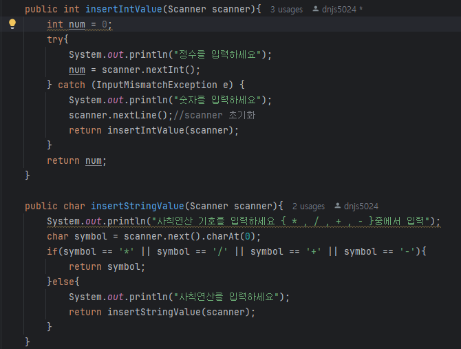

잘못된값 입력 시 재귀함수로 다시 입력 받음, 

> 계산 메소드

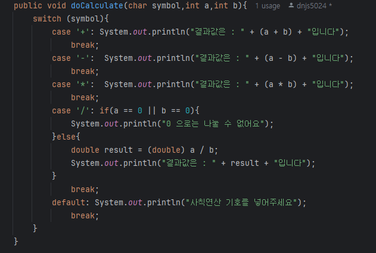

사용자가 입력한 symbol을 기준으로 계산 나누기는 0으로 나눌 수 없으므로 결과 출력 x

---

2️⃣2단계 
-
- 실행 class ,계산 class ,메시지 출력 class 나눠서 개발, 
- 기존기능에 계산 후 데이터들을 저장하고 삭제,기존 데이터 복원하는 기능을 추가
- 데이터를 private 선언 getter,setter 통해 접근가능(캡슐화)
- 데이터 저장 List를 Number로 선언해서 Integer,Double 받을 수 있게(다형성)

  구조 

>1.App.class // 계산기 실행

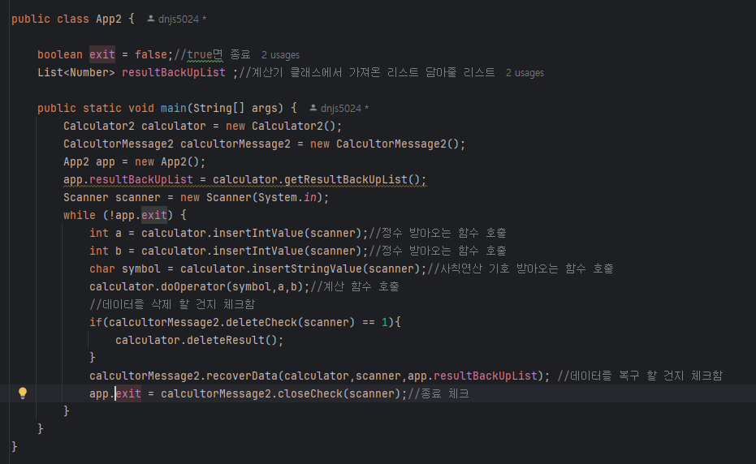

>2.Calculator.class // 데이터 처리 

-> 기존 계산 함수에서 추가된 기능들

1. 가장 먼저 저장한 데이터 삭제 메소드
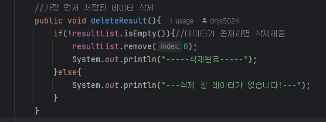
2. private데이터 활용하게 Getter,Setter 선언
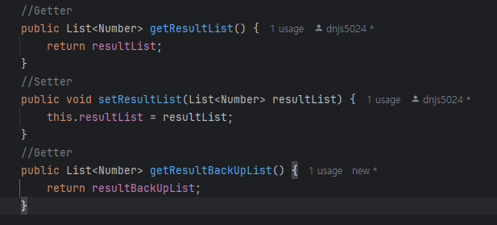
3. 계산 한 데이터를 백업,저장 할 수있는 리스트 선언 기존 계산함수에 저장하는 부분 추가
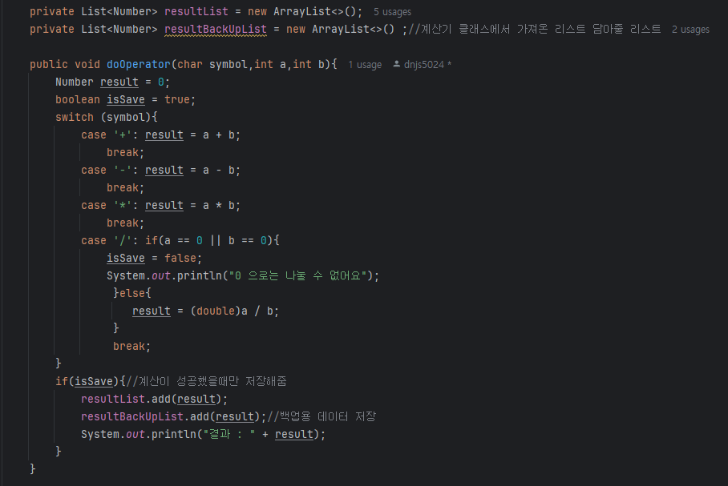

>3.CalculatorMessage.class // 사용자 안내 메시지 

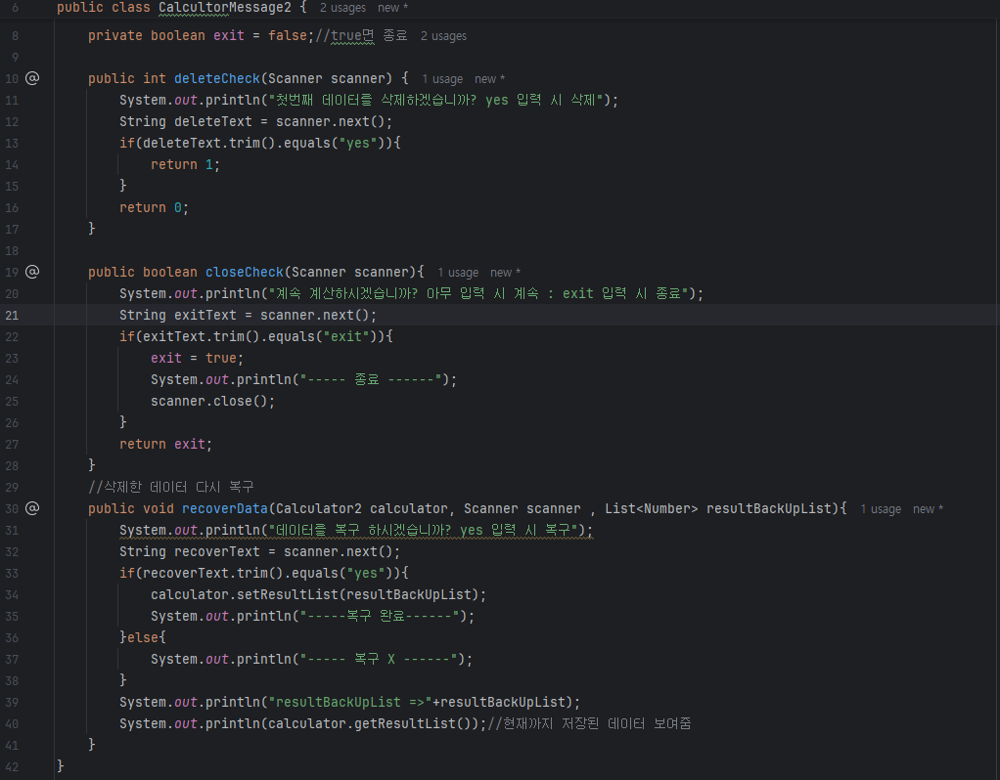

---
3️⃣3단계 
-
-----

- 구조는 2단계에서 인터페이스 추가하고 Enum,람다,stream(),제네릭 활용하여 개발

>계산 메소드 변경점

- 기존

- 변경 후

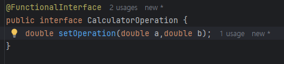
- 람다 활용 가능하게 @Function 이노테이션 선언

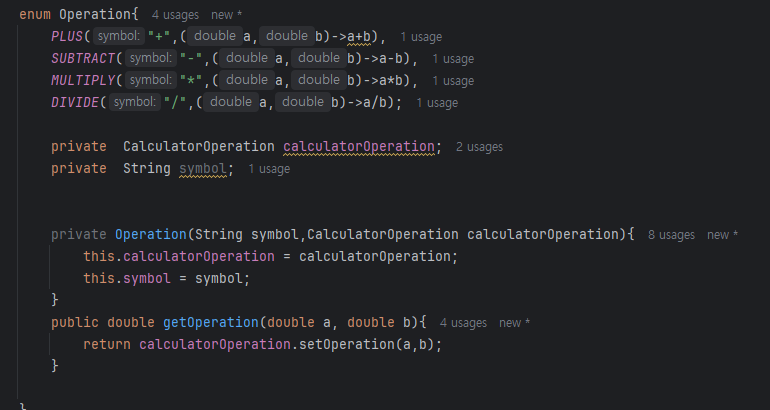
- enum 상수로 사칙연산 객체 선언, 상수 호출 시 생성자를 통해 symbol,
- 람다로 선언한 함수를 private 선언한 변수에 저장, 
- getOperation 함수 호출을 통해 접근해서 계산해줌

---

>
